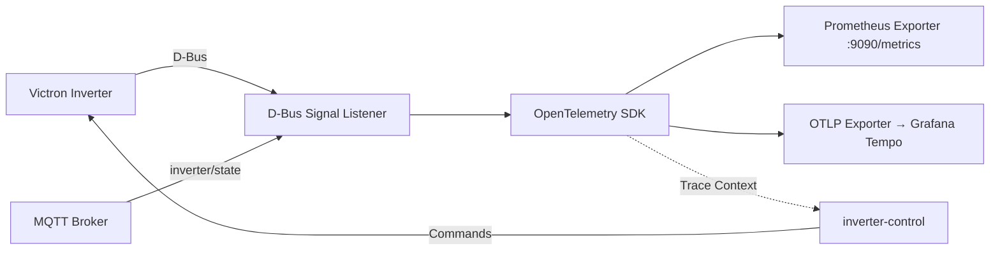

# Venus OS Observability

OpenTelemetry/Prometheus observability stack for Victron Venus OS — D-Bus event tracing, inverter metrics export, and distributed tracing across the MQTT → D-Bus → inverter-control pipeline.

## Architecture



## Features

- **D-Bus Signal Tracing**: Capture all Victron D-Bus signals with OpenTelemetry spans
- **Prometheus Metrics**: Export inverter state (SOC, power, grid, battery) as Prometheus metrics
- **Distributed Tracing**: Correlation IDs propagated across MQTT → D-Bus → inverter-control
- **Grafana Tempo Integration**: Visualize trace timelines in Grafana
- **Cerbo GX Ready**: Runs as native service on Venus OS or in Docker (no pip required - offline wheel install)

## Quick Start

### Docker Compose (Recommended)

```yaml
services:
  venus-observability:
    image: ghcr.io/victron-venus/venus-os-observability:latest
    environment:
      - DBUS_SYSTEM_BUS_ADDRESS=unix:path=/host/run/dbus/system_bus_socket
      - OTEL_EXPORTER_OTLP_ENDPOINT=http://tempo:4317
      - PROMETHEUS_PORT=9090
    volumes:
      - /run/dbus:/run/dbus
    ports:
      - "9090:9090"
    restart: unless-stopped
```

### Venus OS Native (Cerbo GX) - Offline Wheel Install

Venus OS has no `pip` by default. Use the offline wheel bundle:

```bash
# On Cerbo GX (SSH as root)
cd /tmp

# 1. Download pre-built wheel bundle (ARMv7/aarch64 compatible)
wget https://github.com/victron-venus/venus-os-observability/releases/download/v0.1.0/venus-os-observability-wheels.tar.gz

# 2. Extract wheels
tar -xzf venus-os-observability-wheels.tar.gz

# 3. Install using Python's built-in wheel support (no pip needed)
python3 -m pip install --no-index --find-links=. venus_os_observability-0.1.0-py3-none-any.whl

# 4. Copy systemd service and config
cp /usr/local/lib/python3.*/site-packages/venus_observability/systemd/venus-os-observability.service /etc/systemd/system/
mkdir -p /etc/venus-os-observability
cp config.example.yaml /etc/venus-os-observability/config.yaml

# 5. Enable and start
systemctl daemon-reload
systemctl enable --now venus-os-observability
```
  pyyaml-*.whl \
  structlog-*.whl \
  click-*.whl

# 5. Copy service file and config
cp /usr/local/lib/python3.*/site-packages/venus_observability/systemd/venus-os-observability.service /etc/systemd/system/
mkdir -p /etc/venus-os-observability
cp config.example.yaml /etc/venus-os-observability/config.yaml

# 6. Enable and start
systemctl daemon-reload
systemctl enable --now venus-os-observability
```

#### If `python3 -m pip` fails (no pip module):

```bash
# Install pip first via opkg (if feed available)
opkg update && opkg install python3-pip

# OR manually bootstrap pip
wget https://bootstrap.pypa.io/get-pip.py
python3 get-pip.py --no-index --find-links=/tmp/wheels
```

### Build Wheel Bundle Locally (for release artifacts)

```bash
# On build machine (Linux ARM or cross-compile)
pip install -e ".[dev]"
pip wheel --no-deps --wheel-dir=./wheels .
pip wheel --wheel-dir=./wheels \
  opentelemetry-api opentelemetry-sdk opentelemetry-exporter-prometheus \
  opentelemetry-exporter-otlp opentelemetry-instrumentation-requests \
  opentelemetry-instrumentation-paho-mqtt prometheus-client paho-mqtt \
  dbus-next pyyaml structlog click

# Create release tarball
tar -czf venus-os-observability-wheels.tar.gz wheels/
# Upload to GitHub Releases
```

## Configuration

| Env Var | Default | Description |
|---------|---------|-------------|
| `DBUS_SYSTEM_BUS_ADDRESS` | `unix:path=/var/run/dbus/system_bus_socket` | D-Bus connection |
| `OTEL_EXPORTER_OTLP_ENDPOINT` | - | Tempo/Grafana OTLP endpoint |
| `PROMETHEUS_PORT` | `9090` | Prometheus metrics port |
| `OTEL_SERVICE_NAME` | `venus-os-observability` | Service name for traces |
| `LOG_LEVEL` | `INFO` | Logging level |

## Metrics Exported

| Metric | Type | Description |
|--------|------|-------------|
| `victron_battery_soc` | Gauge | Battery state of charge % |
| `victron_battery_power` | Gauge | Battery charge/discharge power (W) |
| `victron_pv_power` | Gauge | Total PV production (W) |
| `victron_grid_power` | Gauge | Grid import/export (W) |
| `victron_ac_loads` | Gauge | AC loads consumption (W) |
| `victron_inverter_state` | Gauge | Inverter state machine (0=off,1=on,2=charging,3=inverting) |

## Development

```bash
# Install deps
pip install -e ".[dev]"

# Run tests
pytest

# Lint
ruff check src tests
mypy src/venus_observability
```

## License

MIT