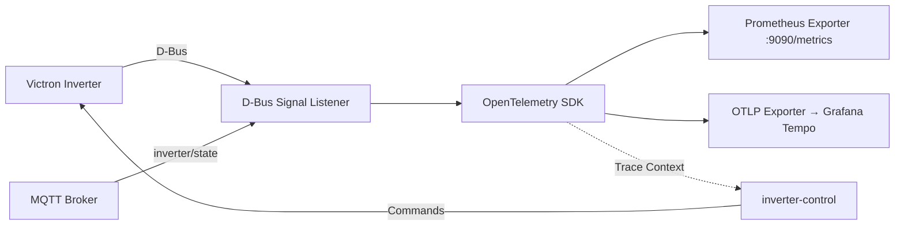

# Venus OS Observability

OpenTelemetry/Prometheus observability stack for Victron Venus OS — D-Bus event tracing, inverter metrics export, and distributed tracing across the MQTT → D-Bus → inverter-control pipeline.

## Architecture



## Features

- **D-Bus Signal Tracing**: Capture all Victron D-Bus signals with OpenTelemetry spans
- **Prometheus Metrics**: Export inverter state (SOC, power, grid, battery) as Prometheus metrics
- **Distributed Tracing**: Correlation IDs propagated across MQTT → D-Bus → inverter-control
- **Grafana Tempo Integration**: Visualize trace timelines in Grafana
- **Cerbo GX Ready**: Runs as native service on Venus OS or in Docker (no pip required - offline wheel install)

## Quick Start

### Docker Compose (Recommended)

```yaml
services:
  venus-observability:
    image: ghcr.io/victron-venus/venus-os-observability:latest
    environment:
      - DBUS_SYSTEM_BUS_ADDRESS=unix:path=/host/run/dbus/system_bus_socket
      - OTEL_EXPORTER_OTLP_ENDPOINT=http://tempo:4317
      - PROMETHEUS_PORT=9090
    volumes:
      - /run/dbus:/run/dbus
    ports:
      - "9090:9090"
    restart: unless-stopped
```

### Venus OS Native (Cerbo GX) - Offline Wheel Install

Venus OS has no `pip` by default. Use the offline wheel bundle:

```bash
# On Cerbo GX (SSH as root)
cd /tmp

# 1. Download pre-built wheel bundle (ARMv7/aarch64 compatible)
wget https://github.com/victron-venus/venus-os-observability/releases/download/v0.1.0/venus-os-observability-wheels.tar.gz

# 2. Extract wheels
tar -xzf venus-os-observability-wheels.tar.gz

# 3. Install using Python's built-in wheel support (no pip needed)
python3 -m pip install --no-index --find-links=. venus_os_observability-0.1.0-py3-none-any.whl

# 4. Copy systemd service and config
cp /usr/local/lib/python3.*/site-packages/venus_observability/systemd/venus-os-observability.service /etc/systemd/system/
mkdir -p /etc/venus-os-observability
cp config.example.yaml /etc/venus-os-observability/config.yaml

# 5. Enable and start
systemctl daemon-reload
systemctl enable --now venus-os-observability
```
  pyyaml-*.whl \
  structlog-*.whl \
  click-*.whl

# 5. Copy service file and config
cp /usr/local/lib/python3.*/site-packages/venus_observability/systemd/venus-os-observability.service /etc/systemd/system/
mkdir -p /etc/venus-os-observability
cp config.example.yaml /etc/venus-os-observability/config.yaml

# 6. Enable and start
systemctl daemon-reload
systemctl enable --now venus-os-observability
```

#### If `python3 -m pip` fails (no pip module):

```bash
# Install pip first via opkg (if feed available)
opkg update && opkg install python3-pip

# OR manually bootstrap pip
wget https://bootstrap.pypa.io/get-pip.py
python3 get-pip.py --no-index --find-links=/tmp/wheels
```

### Build Wheel Bundle Locally (for release artifacts)

```bash
# On build machine (Linux ARM or cross-compile)
pip install -e ".[dev]"
pip wheel --no-deps --wheel-dir=./wheels .
pip wheel --wheel-dir=./wheels \
  opentelemetry-api opentelemetry-sdk opentelemetry-exporter-prometheus \
  opentelemetry-exporter-otlp prometheus-client pyyaml structlog click

# Create release tarball
tar -czf venus-os-observability-wheels.tar.gz wheels/
# Upload to GitHub Releases
```

## Configuration

| Env Var | Default | Description |
|---------|---------|-------------|
| `DBUS_SYSTEM_BUS_ADDRESS` | `unix:path=/var/run/dbus/system_bus_socket` | D-Bus connection |
| `OTEL_EXPORTER_OTLP_ENDPOINT` | - | Tempo/Grafana OTLP endpoint |
| `PROMETHEUS_PORT` | `9090` | Prometheus metrics port |
| `OTEL_SERVICE_NAME` | `venus-os-observability` | Service name for traces |
| `LOG_LEVEL` | `INFO` | Logging level |

## Metrics Exported

| Metric | Type | Description |
|--------|------|-------------|
| `victron_battery_soc` | Gauge | Battery state of charge % |
| `victron_battery_power` | Gauge | Battery charge/discharge power (W) |
| `victron_pv_power` | Gauge | Total PV production (W) |
| `victron_grid_power` | Gauge | Grid import/export (W) |
| `victron_ac_loads` | Gauge | AC loads consumption (W) |
| `victron_inverter_state` | Gauge | Inverter state machine (0=off,1=on,2=charging,3=inverting) |

## Alert Delivery Setup

Grafana evaluates the alert rules in folder **Venus Observability** (`venus-agent-down`,
`venus-dbus-errors`, `venus-signals-stale`). Three delivery channels:

| Channel | Path | Status |
|---|---|---|
| MQTT banners | Grafana → `alert-mqtt-bridge` → `inverter/notifications` | deployed, default receiver |
| Telegram | Grafana → Telegram Bot API | needs bot token + chat id |
| Email | Grafana → external SMTP relay (Brevo/Mailjet, :587) | needs provider account + domain verification |

> **Secrets rule:** real tokens and passwords never go into this repository.
> README examples keep `<placeholders>`; actual values live in
> `/volume1/docker/inverter-monitoring/.env` on Synology (not a git repo) or inside
> the Grafana database. For a local working copy use a `*.local` file — already
> covered by `.gitignore`.

### Channel 1: MQTT banners (already live)

Source: [`alert-mqtt-bridge/`](alert-mqtt-bridge/). Container `venus-alert-bridge`
on Synology, contact point **MQTT bridge** is the default notification receiver.
Nothing to configure — new alert rules are delivered automatically.

### Channel 2: Telegram

#### 2.1 Create the bot with @BotFather

1. In Telegram, open **@BotFather** (verified badge) and send `/newbot`.
2. Answer two prompts:
   - **name** — display name, anything, e.g. `Alvit Venus Alerts`
   - **username** — must end in `bot`, e.g. `alvit_venus_alerts_bot`
3. BotFather replies with the **token**, format:

   ```
   1234567890:AAHfJ8xQm3k9...your-token-here
   ```

   Keep it secret: anyone with this token controls your bot.

Useful extra commands later: `/mybots` → edit name/description,
`/revoke` → invalidate and reissue a token, `/deletebot`.

#### 2.2 Get your chat id

A bot cannot message you first — start the chat yourself:

1. Open your new bot in Telegram and press **Start** (send any message).
2. Then fetch recent updates (run anywhere with internet):

   ```bash
   curl -s https://api.telegram.org/bot<YOUR_BOT_TOKEN>/getUpdates
   ```

3. Find your id in the response:

   ```json
   {"result":[{"message":{"chat":{"id":987654321,"first_name":"..."}}}]}
   ```

   That `id` number is your **chat id**. Alternative: send any message to
   **@userinfobot** and it replies with your id.

For a **group chat**: add the bot to the group, post one message there, then call
`getUpdates` again — the group's `chat.id` is negative (e.g. `-1001234567890`);
use it as-is.

#### 2.3 Create the contact point

SSH to Synology; admin password comes from the container env:

```bash
export PATH=/usr/local/bin:$PATH
GP=$(sudo docker exec grafana env | grep GF_SECURITY_ADMIN_PASSWORD | cut -d= -f2)

curl -s -u admin:$GP -X POST http://localhost:3000/api/v1/provisioning/contact-points \
  -H 'Content-Type: application/json' -d '{
    "name": "Telegram",
    "type": "telegram",
    "settings": {"bottoken": "<YOUR_BOT_TOKEN>", "chatid": "<CHAT_ID>"},
    "disableResolveMessage": false
  }'
```

Note the returned `uid` — needed for the policy fan-out below. The token is stored
encrypted in Grafana's database, not on disk in plain text.

#### 2.4 Route alerts to both channels

The default notification policy holds ONE receiver. Add a catch-all nested policy so
every alert fans out to MQTT *and* Telegram (replace uids as printed by the API):

```bash
curl -s -u admin:$GP -X PUT http://localhost:3000/api/v1/provisioning/policies \
  -H 'Content-Type: application/json' -d '{
    "receiver": "MQTT bridge",
    "group_by": ["grafana_folder", "alertname"],
    "policies": [{"receiver": "Telegram", "continue": true}]
  }'
```

(`continue: true` keeps evaluation going so nested policies chain; when Email is
added later it becomes another entry after Telegram.)

#### 2.5 Verify end-to-end

Temporarily stop the agent on Cerbo — `venus-agent-down` fires after its `for` window:

```bash
ssh root@cerbo 'svc -d /service/venus-os-observability'   # pause
# wait ~2-3 min: Telegram message + dashboard banner appear
ssh root@cerbo 'svc -u /service/venus-os-observability'   # resume -> resolved message
```

### Channel 3: Email via external SMTP relay

Tested 2026-08-24: outbound port 25 is **blocked by the ISP**
(`nc -vz gmail-smtp-in.l.google.com 25` → timed out), and PTR on a residential
IP is unavailable. Direct delivery from a self-hosted MTA is therefore impossible —
any local Postfix/Stalwart would stall at the first hop.

The working architecture: Grafana authenticates to an **external SMTP relay**
(transactional email provider) on port 587 and hands mail over TLS; the provider
delivers onward. Domain `alvit.2560801.xyz` is verified at the provider
(SPF/DKIM records in your DNS zone), so mail goes out as `alerts@alvit.2560801.xyz`
with full authorization — no mail server to run, nothing extra on Synology.
Alert volumes (a few per day) fit every free tier.

#### 3.1 Pick a provider and sign up

| Provider | Free quota | Card required | SMTP endpoint |
|---|---|---|---|
| [Brevo](https://www.brevo.com) | 300/day | no | `smtp-relay.brevo.com:587` |
| [Mailjet](https://www.mailjet.com) | 200/day | no | `in-v3.mailjet.com:587` |
| [SendGrid](https://sendgrid.com) | 100/day | yes | `smtp.sendgrid.net:587` |

Confirm the signup, log into the console.

#### 3.2 Verify the domain alvit.2560801.xyz

In the provider console open **Senders / Domains → Add domain**, enter
`alvit.2560801.xyz`. The console prints the exact DNS records — copy them
verbatim into the DNS zone serving `alvit.2560801.xyz`:

| Record | Typical shape | Purpose |
|---|---|---|
| TXT | `v=spf1 include:<provider-spf-domain> -all` at the zone apex | authorizes provider IPs to send for the domain |
| CNAME or TXT | `<selector>._domainkey.alvit.2560801.xyz` | DKIM signing key |
| TXT (optional) | `_dmarc.alvit.2560801.xyz` → `v=DMARC1; p=none; rua=mailto:<you@...>` | DMARC reports while tuning |

Press **Verify** in the console once DNS propagates (minutes to an hour).
The exact hosts/values are provider-specific — always use what the console
prints, not the shapes above.

#### 3.3 Create SMTP credentials and wire Grafana

Console → **SMTP & API → Create new key** → get login + secret key.

On Synology create `/volume1/docker/inverter-monitoring/.env` next to the compose
file (compose auto-reads it; file lives outside any git repo):

```bash
# Brevo example; substitute the endpoint/login/key of your provider
GF_SMTP_ENABLED=true
GF_SMTP_HOST=smtp-relay.brevo.com:587
GF_SMTP_USER=<smtp-login>
GF_SMTP_PASSWORD=<smtp-key>
GF_SMTP_FROM_ADDRESS=alerts@alvit.2560801.xyz
GF_SMTP_FROM_NAME=Venus Alerts
```

No `SKIP_VERIFY` needed — providers run valid certificates.

```bash
chmod 600 /volume1/docker/inverter-monitoring/.env
cd /volume1/docker/inverter-monitoring && sudo docker compose up -d grafana
```

#### 3.4 Email contact point + fan-out

```bash
export PATH=/usr/local/bin:$PATH
GP=$(sudo docker exec grafana env | grep GF_SECURITY_ADMIN_PASSWORD | cut -d= -f2)
curl -s -u admin:$GP -X POST http://localhost:3000/api/v1/provisioning/contact-points \
  -H 'Content-Type: application/json' -d '{
    "name": "Email",
    "type": "email",
    "settings": {"addresses": "<you@your-real-mailbox.example>"},
    "disableResolveMessage": false
  }'
```

Extend the policy fan-out (Telegram entry stays, Email chains after it):

```bash
curl -s -u admin:$GP -X PUT http://localhost:3000/api/v1/provisioning/policies \
  -H 'Content-Type: application/json' -d '{
    "receiver": "MQTT bridge",
    "group_by": ["grafana_folder", "alertname"],
    "policies": [
      {"receiver": "Telegram", "continue": true},
      {"receiver": "Email", "continue": false}
    ]
  }'
```

#### 3.5 Verify deliverability

1. Trigger a firing alert (stop the agent per 2.5) → check inbox AND spam folder.
2. The provider console shows per-message events (delivered / bounced /
   spam-complaints) — the fastest place to diagnose rejects.
3. Optional one-shot scoring: send a test via the same relay to the address
   shown at <https://www.mail-tester.com>; aim for ≥9/10.

## Development

```bash
# Install deps
pip install -e ".[dev]"

# Run tests
pytest

# Lint
ruff check src tests
mypy src/venus_observability
```

## License

MIT

---

## Related Projects

| Project | Scope | When to Use |
|---------|-------|-------------|
| [mqtt-observability-opentelemetry](https://github.com/4alvit/mqtt-observability-opentelemetry) | **Generic** — Works with ANY MQTT broker. No Venus OS dependency. | Generic MQTT/IoT observability, any broker, any device types |
| **venus-os-observability** (this) | **Venus OS specific** — Depends on D-Bus, Victron protocols. | Victron Venus OS only: D-Bus event tracing, inverter metrics, Cerbo GX integration |

**Choose mqtt-observability-opentelemetry if:** You need MQTT observability for any IoT system (industrial, home automation, custom devices).

**Choose this repo if:** You are running Victron Venus OS (Cerbo GX, Raspberry Pi with Venus OS) and need D-Bus integration, inverter-specific metrics, and Venus OS native deployment.
