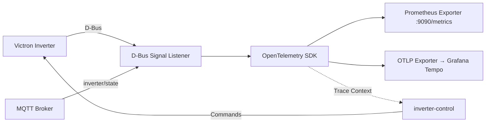
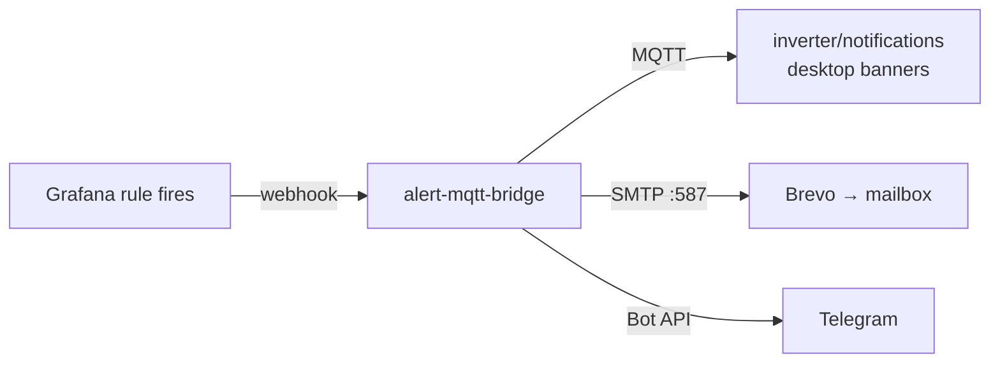

# Venus OS Observability

OpenTelemetry/Prometheus observability stack for Victron Venus OS — D-Bus event tracing, inverter metrics export, and distributed tracing across the MQTT → D-Bus → inverter-control pipeline.

## Architecture



## Features

- **D-Bus Signal Tracing**: Capture all Victron D-Bus signals with OpenTelemetry spans
- **Prometheus Metrics**: Export inverter state (SOC, power, grid, battery) as Prometheus metrics
- **Distributed Tracing**: Correlation IDs propagated across MQTT → D-Bus → inverter-control
- **Grafana Tempo Integration**: Visualize trace timelines in Grafana
- **Cerbo GX Ready**: Runs as native service on Venus OS or in Docker (no pip required - offline wheel install)

## Installation

### Option 1: SetupHelper / PackageManager (Recommended)

**Preferred install path on Cerbo GX / Venus OS** — same as `dbus-ev`, `dbus-evcharger`, and `inverter-control`. Requires [SetupHelper](https://github.com/kwindrem/SetupHelper) on the GX.

The easiest way to install is via SetupHelper PackageManager. The `setup` script is PackageManager-compatible and handles service creation, `/data/rc.local` boot persistence, and restarts.

Package files needed at `/data/venus-os-observability`: `version`, `setup`, `gitHubInfo`, `update.sh`, `src/`, `services/`.

1. **Add package via GUI** (GUI v1):
   - Settings → PackageManager → Inactive packages → **new**
   - Package name: `venus-os-observability`
   - GitHub user: `victron-venus`
   - Branch / tag: `latest` (matches `gitHubInfo`)
   - Proceed → Download → Install

2. **Or on the device**:

```sh
/data/venus-os-observability/setup install
/data/venus-os-observability/setup uninstall
```

`gitHubInfo` is `victron-venus:latest`.

`update.sh` (also called by `setup install`):

- Installs into **`/data/venus-os-observability`** (SetupHelper convention).
- Copies daemontools service to `INSTALL_DIR/service/venus-os-observability/` and symlinks `/service/venus-os-observability`.
- Writes an idempotent **`/data/rc.local`** marker block so the symlink is recreated after reboot (`/service` is tmpfs). Venus OS does **not** run `/data/rc/S99*`.
- Migrates `.venv2` from a legacy `/data/opt/venus-os-observability` install when present.
- Removes the dead `/data/rc/S99venus-os-observability.sh` hook if found.

Manual refresh from a checkout on the Mac:

```sh
# stream repo → device, run update.sh (same pattern as dbus-ev deploy.sh)
COPYFILE_DISABLE=1 tar --no-xattrs \
  --exclude='.git' --exclude='.venv' --exclude='__pycache__' \
  --exclude='.pytest_cache' --exclude='.ruff_cache' --exclude='logs' \
  --exclude='*.egg-info' --exclude='build' --exclude='dist' --exclude='wheels' \
  -czf - -C /path/to/venus-os-observability . \
| ssh root@cerbo 'set -e; rm -rf /data/.vos-obs-deploy; mkdir -p /data/.vos-obs-deploy; \
    tar -xz -C /data/.vos-obs-deploy; sh /data/.vos-obs-deploy/update.sh; \
    rm -rf /data/.vos-obs-deploy; svstat /service/venus-os-observability'
```

Runtime prefers `.venv2/bin/python`, then `.venv/bin/python`, with
`PYTHONPATH=/data/venus-os-observability/src` so source updates take effect.
Installation checks imports before stopping the service, preserves supervisor
directories, and never kills processes merely because their working directory
is the package directory. Only `/data/venus-os-observability` is supported.

The boot hook is inserted before a conventional `exit 0` in `/data/rc.local`.
`/service` is volatile; `/data/rc/S99*` is not a supported boot hook.
Logs use `multilog t s25000 n4` under `/var/log`, approximately 125 KB including
the current file, rather than an unbounded file on persistent flash.

#### Offline wheel bootstrap (first installation)

Check `python3 --version` and `uname -m` on the target first. The audited Cerbo
uses Python 3.12 and ARMv7; Raspberry Pi images may differ. Build the wheel bundle
with `scripts/build_wheels.sh` on a matching Linux architecture/Python ABI.
It resolves versions from `pyproject.toml`, requires binary dependency wheels,
and includes a pip wheel. It is not an ARM cross-compiler. If a native wheel is
unavailable, build it in a matching build environment before deployment.

Venus OS provides `dbus-python` and GLib. Preserve access to these native bindings
using `--system-site-packages`; `dbus-next` cannot replace them for this agent.
Do not install replacement bindings over the firmware's Python packages.

Copy and extract the bundle under `/data/venus-os-observability/wheels`, then:

```sh
cd /data/venus-os-observability
python3 -m venv --system-site-packages --without-pip .venv2
# pip can run directly from its wheel, even when ensurepip is absent.
for wheel in wheels/pip-*.whl; do
    PYTHONPATH="$wheel" .venv2/bin/python -m pip install \
        --no-index --find-links=wheels venus-os-observability
done
sh update.sh
svstat /service/venus-os-observability /service/venus-os-observability/log
tail -n 60 /var/log/venus-os-observability/current
wget -qO - http://127.0.0.1:9090/metrics
```

If the image lacks `venv` itself, prepare a compatible offline virtualenv
bootstrap first; the installer does not silently fetch packages from the
internet. Repeat the bootstrap after firmware changes the Python ABI.

Tracing is optional: install the `tempo` extra from a matching offline bundle
and configure `OTEL_EXPORTER_OTLP_ENDPOINT` only when the device has headroom.
Without it, the sampler drops spans and avoids D-Bus payload serialization;
metrics remain active. D-Bus string subclasses are converted to native strings
before recorded span attributes are validated.

The historical IPK Makefile was an OpenWrt/systemd recipe, not a working Venus
OS package. It now fails with an explicit migration message. The `systemd/`
example is for separate Linux hosts only; native GX deployment uses SetupHelper.

### Option 2: Docker Compose

For non-GX hosts or a containerized stack (not the preferred Cerbo path):

```yaml
services:
  venus-observability:
    image: ghcr.io/victron-venus/venus-os-observability:latest
    environment:
      - DBUS_SYSTEM_BUS_ADDRESS=unix:path=/run/dbus/system_bus_socket
      - OTEL_EXPORTER_OTLP_ENDPOINT=http://tempo:4317
      - PROMETHEUS_PORT=9090
    volumes:
      - /run/dbus:/run/dbus
    ports:
      - "9090:9090"
    restart: unless-stopped
```

## Metrics Exported

| Metric | Type | Description |
|--------|------|-------------|
| `victron_battery_soc` | Gauge | Battery state of charge % |
| `victron_battery_power` | Gauge | Battery charge/discharge power (W) |
| `victron_pv_power` | Gauge | Total PV production (W) |
| `victron_grid_power` | Gauge | Grid import/export (W) |
| `victron_ac_loads` | Gauge | AC loads consumption (W) |
| `victron_inverter_state` | Gauge | Inverter state machine (0=off,1=on,2=charging,3=inverting) |

## Alert Delivery Setup

Grafana evaluates the alert rules in folder **Venus Observability** (`venus-agent-down`,
`venus-dbus-errors`, `venus-signals-stale`). Three delivery channels:

| Channel | Path | Status |
|---|---|---|
| MQTT banners | Grafana → `alert-mqtt-bridge` → `inverter/notifications` | ✅ live |
| Email | Grafana → `alert-mqtt-bridge` → Brevo SMTP relay (`:587`) | ✅ live 2026-08-24 |
| Telegram | Grafana → `alert-mqtt-bridge` → Bot API (`@victronbot`) | ✅ live 2026-08-24 |

> **Secrets rule:** real tokens and passwords never go into this repository.
> README examples keep `<placeholders>`; actual values live in
> `/volume1/docker/inverter-monitoring/.env` on Synology (not a git repo) or inside
> the Grafana database. For a local working copy use a `*.local` file — already
> covered by `.gitignore`.

### Channel 1: MQTT banners (already live)

Source: [`alert-mqtt-bridge/`](alert-mqtt-bridge/). Container `venus-alert-bridge`
on Synology, contact point **MQTT bridge** is the default notification receiver.
Nothing to configure — new alert rules are delivered automatically.

### Channel 2: Telegram

#### 2.1 Create the bot with @BotFather

1. In Telegram, open **@BotFather** (verified badge) and send `/newbot`.
2. Answer two prompts:
   - **name** — display name, anything, e.g. `Alvit Venus Alerts`
   - **username** — must end in `bot`, e.g. `alvit_venus_alerts_bot`
3. BotFather replies with the **token**, format:

   ```
   1234567890:AAHfJ8xQm3k9...your-token-here
   ```

   Keep it secret: anyone with this token controls your bot.

Useful extra commands later: `/mybots` → edit name/description,
`/revoke` → invalidate and reissue a token, `/deletebot`.

#### 2.2 Get your chat id

A bot cannot message you first — start the chat yourself:

1. Open your new bot in Telegram and press **Start** (send any message).
2. Then fetch recent updates (run anywhere with internet):

   ```bash
   curl -s https://api.telegram.org/bot<YOUR_BOT_TOKEN>/getUpdates
   ```

3. Find your id in the response:

   ```json
   {"result":[{"message":{"chat":{"id":987654321,"first_name":"..."}}}]}
   ```

   That `id` number is your **chat id**. Alternative: send any message to
   **@userinfobot** and it replies with your id.

For a **group chat**: add the bot to the group, post one message there, then call
`getUpdates` again — the group's `chat.id` is negative (e.g. `-1001234567890`);
use it as-is.

#### 2.3 Wire the bridge (Synology)

Grafana's Telegram integration is a silent no-op in this build, same as
email — the bridge sends instead. Append to
`/volume1/docker/venus-alert-bridge/envfile` (chmod 600, outside git):

```
TG_BOT_TOKEN=<your-bot-token>
TG_CHAT_ID=<your-chat-id>
```

(`TG_CHAT_ID` accepts a comma-separated list for group chats.) Then rebuild
and recreate the container per **Channel 3 → 3.2**. Nothing else to
configure: every firing/resolved alert goes to MQTT banners + email +
Telegram from one webhook.

#### 2.5 Verify end-to-end

Temporarily stop the agent on Cerbo — `venus-agent-down` fires after its `for` window:

```bash
ssh root@cerbo 'svc -d /service/venus-os-observability'   # pause
# wait ~2-3 min: Telegram message + dashboard banner appear
ssh root@cerbo 'svc -u /service/venus-os-observability'   # resume -> resolved message
```

### Channel 3: Email via alert-mqtt-bridge + external SMTP relay (live)

Tested 2026-08-24: outbound port 25 is **blocked by the ISP** and PTR on a
residential IP is unavailable, so direct delivery from a self-hosted MTA is
impossible. Additionally, this Grafana build (12.4.2, watchtower-upgraded)
accepts an Email contact point but delivers silently to nowhere — no SMTP
attempt logged, no provider-side events. So email fan-out lives in the
**bridge**, which already receives every webhook reliably:



#### 3.1 Provider setup (Brevo, one-time)

1. Sign up at <https://www.brevo.com> (free tier: 300 emails/day, no card).
2. **Senders & Domains → Senders → Add sender**: use your real mailbox
   (e.g. a gmail address) and click the confirmation link Brevo emails you.
   This skips domain/DKIM work entirely; trade-off: mail goes out "via brevo"
   and may land in spam until you mark it as not-spam once.
   (Better deliverability later: verify `alvit.2560801.xyz` under Domains,
   copy the DKIM records into your DNS zone, send from that domain.)
3. **SMTP & API → SMTP → Create new key**: note LOGIN and SECRET KEY.

#### 3.2 Bridge configuration (Synology)

Secrets live in `/volume1/docker/venus-alert-bridge/envfile` (chmod 600,
outside any git repo):

```
SMTP_HOST=smtp-relay.brevo.com
SMTP_PORT=587
SMTP_USER=<login>@smtp-brevo.com
SMTP_PASSWORD=<secret-key>
SMTP_FROM=<verified-sender@example.com>
SMTP_TO=<recipient@example.com>
```

`SMTP_HOST` or `SMTP_TO` empty ⇒ email channel disabled, MQTT-only.

Deploy/update the container:

```bash
cd /volume1/docker/venus-alert-bridge
sudo docker build -t venus-alert-bridge:latest .
sudo docker rename venus-alert-bridge venus-alert-bridge-old && sudo docker stop venus-alert-bridge-old
sudo docker run -d --name venus-alert-bridge --restart unless-stopped \
  --network inverter-monitoring_monitoring --network-alias venus-alert-bridge \
  -e MQTT_HOST=192.168.160.150 --env-file envfile venus-alert-bridge:latest
```

No Email contact point in Grafana and no nested notification policies —
the default policy stays pointed at the **MQTT bridge** webhook only.

#### 3.3 Verify

1. Trigger a firing alert (stop the agent per channel 2.5).
2. Bridge log shows `Email sent: <alertname>`; check inbox AND spam folder.
3. Brevo console → Transactional → Statistics shows per-message events
   (delivered / blocked / rejected) — fastest place to diagnose rejects.
4. Optional scoring: send a test via the same relay to the address shown at
   <https://www.mail-tester.com>; aim for ≥9/10.

## Development

```bash
# Install deps
pip install -e ".[dev]"

# Run tests
pytest

# Lint
ruff check src tests
mypy src/venus_observability
```

## License

MIT

---

## Related Projects

| Project | Scope | When to Use |
|---------|-------|-------------|
| [mqtt-observability-opentelemetry](https://github.com/4alvit/mqtt-observability-opentelemetry) | **Generic** — Works with ANY MQTT broker. No Venus OS dependency. | Generic MQTT/IoT observability, any broker, any device types |
| **venus-os-observability** (this) | **Venus OS specific** — Depends on D-Bus, Victron protocols. | Victron Venus OS only: D-Bus event tracing, inverter metrics, Cerbo GX integration |

**Choose mqtt-observability-opentelemetry if:** You need MQTT observability for any IoT system (industrial, home automation, custom devices).

**Choose this repo if:** You are running Victron Venus OS (Cerbo GX, Raspberry Pi with Venus OS) and need D-Bus integration, inverter-specific metrics, and Venus OS native deployment.
