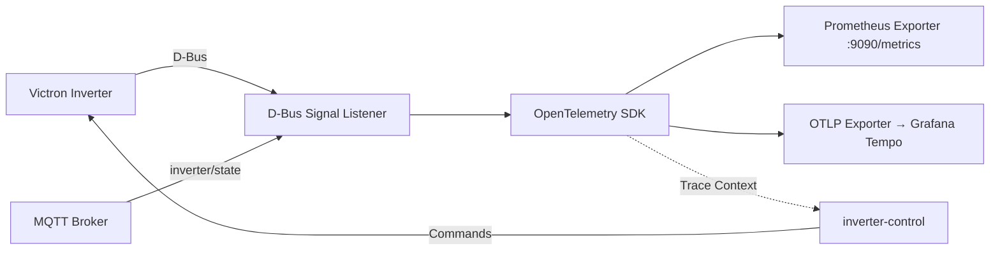

# Venus OS Observability

OpenTelemetry/Prometheus observability stack for Victron Venus OS — D-Bus event tracing, inverter metrics export, and distributed tracing across the MQTT → D-Bus → inverter-control pipeline.

## Architecture



## Features

- **D-Bus Signal Tracing**: Capture all Victron D-Bus signals with OpenTelemetry spans
- **Prometheus Metrics**: Export inverter state (SOC, power, grid, battery) as Prometheus metrics
- **Distributed Tracing**: Correlation IDs propagated across MQTT → D-Bus → inverter-control
- **Grafana Tempo Integration**: Visualize trace timelines in Grafana
- **Cerbo GX Ready**: Runs as native service on Venus OS or in Docker

## Quick Start

### Docker Compose

```yaml
services:
  venus-observability:
    image: ghcr.io/victron-venus/venus-os-observability:latest
    environment:
      - DBUS_SYSTEM_BUS_ADDRESS=unix:path=/host/run/dbus/system_bus_socket
      - OTEL_EXPORTER_OTLP_ENDPOINT=http://tempo:4317
      - PROMETHEUS_PORT=9090
    volumes:
      - /run/dbus:/run/dbus
    ports:
      - "9090:9090"
    restart: unless-stopped
```

### Venus OS Native

```bash
# On Cerbo GX
opkg install python3-opentelemetry
# Copy service files to /etc/venus-os-observability/
systemctl enable --now venus-os-observability
```

## Configuration

| Env Var | Default | Description |
|---------|---------|-------------|
| `DBUS_SYSTEM_BUS_ADDRESS` | `unix:path=/var/run/dbus/system_bus_socket` | D-Bus connection |
| `OTEL_EXPORTER_OTLP_ENDPOINT` | - | Tempo/Grafana OTLP endpoint |
| `PROMETHEUS_PORT` | `9090` | Prometheus metrics port |
| `OTEL_SERVICE_NAME` | `venus-os-observability` | Service name for traces |
| `LOG_LEVEL` | `INFO` | Logging level |

## Metrics Exported

| Metric | Type | Description |
|--------|------|-------------|
| `victron_battery_soc` | Gauge | Battery state of charge % |
| `victron_battery_power` | Gauge | Battery charge/discharge power (W) |
| `victron_pv_power` | Gauge | Total PV production (W) |
| `victron_grid_power` | Gauge | Grid import/export (W) |
| `victron_ac_loads` | Gauge | AC loads consumption (W) |
| `victron_inverter_state` | Gauge | Inverter state machine (0=off,1=on,2=charging,3=inverting) |

## Development

```bash
# Install deps
pip install -e ".[dev]"

# Run tests
pytest

# Lint
ruff check src tests
mypy src/venus_observability
```

## License

MIT